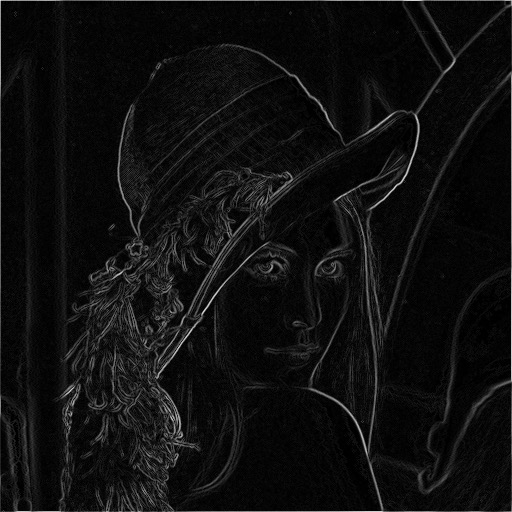
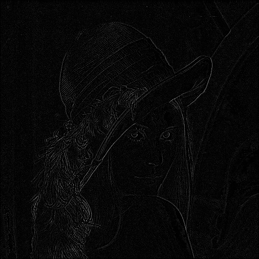

# SwiftImageProcessor
This is a sample project for image processing by Metal. Can try on macOS.

You can see the mechanism is [here](https://medium.com/@yuyaHorita/swift-metal-image-processing-75f1c2342306)

# Edge Detection
Input image.

Derivatives

Laplace

# Smoothing

Input image.

Gaussian

Bilateral

